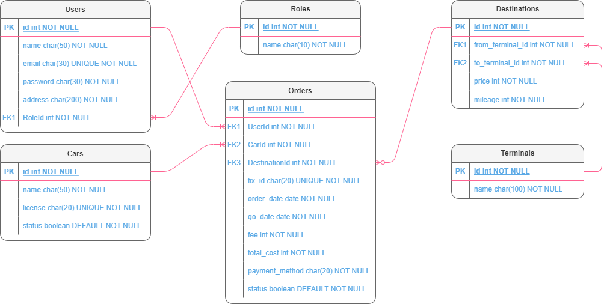

## Latihan Sesi Zoom
- Perbaikan code untuk latihan dari sesi zoom

## Tugas Project Travel API
- Membuat API pemesanan travel
- Todo List:
  - [x] Membuat Model MVC
  - [x] Mengimplementasikan Migrasi
  - [x] Mengimplementasikan JWT
  - [x] Menampilkan API
- Installasi
  - install package json di dalam folder root `npm run i`
  - atur nama database ke file `travel-api/app/config/config.json`
  - migrasi attributes di dalam folder `tarvel-api/app` dengan perintah `npx sequelize-cli db:migrate`
  - masukan data yang diperlukan dengan seeder di dalam foler yang sama seperti migrasi dengan perintah `npx sequelize-cli db:seed:all`
  - baca dokumentasi api dengan menjalankan aplikasi di path `localhost:3000/api`

## Cara Penggunaan
- Untuk perbaikan code dari sesi zoom ketik `npm run sudah-fix` (jangan lupa untuk migrate dan seed roles table sebelumnya)
- Untuk menjalankan project Travel API ketik `npm run dev` (jangan lupa untuk migrate dan seed sebelumnya)

## ERD Database

